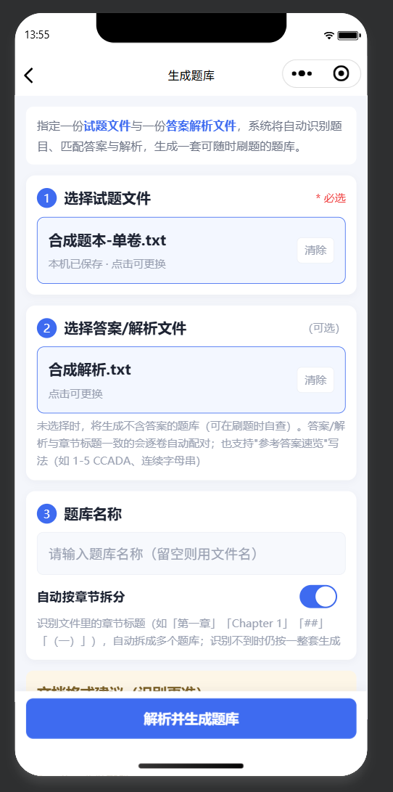
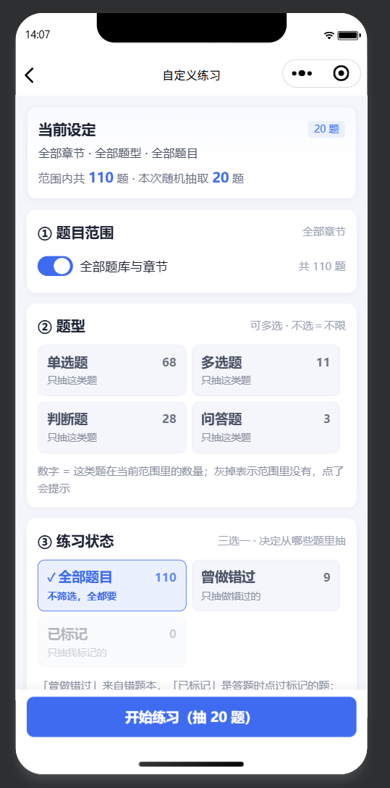

# 轻刷题 · 端上解析的微信刷题小程序

> 导入**试题文本 + 答案解析文本**，在小程序**本机**完成题目切分、答案解析抽取与逐题对齐，生成可随时刷题的题库。
> 纯本地运行：不依赖云开发，无云存储、无云数据库、无云函数，**填个 AppID 就能跑**。

`微信小程序` · `纯本地存储` · `零依赖解析引擎` · `1181 项离线测试` · `自带无版权语料的端到端比对`

---

## 一、项目亮点

| 亮点 | 说明 |
|---|---|
| **端上跑完整解析引擎** | 758 行纯 JS 引擎（切题 / 抽答案 / 序列对齐 / 按位置装配）零 Node 依赖，直接跑在小程序里，三种运行环境（小程序 / Node / 云函数）共用同一份代码 |
| **靠「存储分层」绕过平台限制** | `setStorageSync` 单 key 上限 1MB，而一本 1000 题的题库 JSON 约 1.6MB 会直接写入失败 → 拆成「索引进 storage、明细进沙箱文件系统」，实测 1.6MB/本、沙箱可放约 100 本 |
| **题号重复也能正确对齐** | 真实教辅的题号按考点多次重置（5 本实测分别重置 6 / 91 / 98 / 51 / 52 次），按题号查表必然串位 → 改用**单调 DP 序列对齐 + 按位置装配**，真实语料匹配率 97.4%~98.4% |
| **一份真源 + 单向同步 + 四层护栏** | 引擎核心需在两端各存一份（小程序无法 require 到包外），靠同步脚本 + 字节一致校验 + 「零 Node 依赖」静态护栏 + 无 Node 全局下的实跑验证，防止两份实现漂移 |
| **能说清平台的边界在哪** | 明确论证「从设备任意位置选文件」在小程序上**无 API 支撑**，并给出 H5 / 桌面端两条替代路径，而不是含糊承诺 |
| **写入失败不许静默** | `setStorageSync` 满 10MB 会抛错。改造前有的地方裸调（异常冒到页面），有的地方 `catch` 吞掉（错题本**无声丢失**）→ 统一到一层：强一致场景抛出可读错误，高频写记录待提示错误由页面一次性告知 |
| **重构而非推倒重来** | v1 是云开发版，v2 完成一次彻底的去云化重构；云端实现归档在 `legacy/` 作为架构演进证据 |

### 两个值得一读的工程记录

- **用交叉验证发现自己的核对工具出错**：一份「279 处答案不一致」的报告，追根究底是核对脚本取字母串时带入了 CRLF 换行符产生的 103 个伪字符；换用「印刷题号锚点」判据后，锚定吻合处两侧一致率 99.6%，真实冲突只有 8 处。
- **示例数据抓出解析 bug**：多选（`ABD`）与判断题两字写法（`正确`/`错误`）被静默判成「无答案」，而题目仍显示「已匹配」——指标健康度掩盖了答案缺失。

两则详情见 [`docs/架构决策记录.md`](docs/架构决策记录.md)。

---

## 二、界面预览

<table>
  <tr>
    <td align="center" width="33%"><br><b>首页</b><br><sub>继续刷题卡片、题库列表、数据备份与本机占用</sub></td>
    <td align="center" width="33%"><br><b>答题页</b><br><sub>作答后即时判定，参考答案与解析展开</sub></td>
    <td align="center" width="33%"><br><b>错题本</b><br><sub>易错题分组、错误次数标签、上次作答</sub></td>
  </tr>
  <tr>
    <td align="center" width="33%"><br><b>校对清单</b><br><sub>原值 ↔ 修正值上下对照，已修 / 待修分流</sub></td>
    <td align="center" width="33%"><br><b>文件库</b><br><sub>文件分类标签、占用统计、导入入口</sub></td>
    <td align="center" width="33%"><br><b>生成向导</b><br><sub>试题 + 答案解析两个槽位，三步生成题库</sub></td>
  </tr>
  <tr>
    <td align="center" width="33%"><br><b>自定义练习</b><br><sub>范围 / 题型 / 状态筛选与题量联动，顶部「当前设定」摘要</sub></td>
    <td align="center" width="33%"></td>
    <td align="center" width="33%"></td>
  </tr>
</table>

<sub>截图取自微信开发者工具模拟器，数据为自带示例题库与一份真实行测题库。</sub>

---

## 三、架构

```
┌──────────────────── 小程序端（全部本地） ────────────────────┐
│  页面层   index / files / generate / preview / custom                 │
│           quiz / result / wrong / errata / review                     │
│              │  只依赖统一门面，全项目无 wx.cloud.* 调用       │
│              ▼                                                │
│  门面层   utils/store.js     导入 · 生成 · 读取 · 删除          │
│              │                                                │
│      ┌───────┼────────────┬──────────────┐                   │
│      ▼       ▼            ▼              ▼                   │
│  localfs  localdb    extract-local  parser-core               │
│  沙箱文件  本地数据层   端上文本抽取   解析引擎（纯 JS，758 行） │
│      │       │                                                │
│      │       └── safestore.js  写入兜底：写失败不许静默         │
│      ▼       ▼                                                │
│  USER_DATA_PATH   +   setStorageSync                          │
│  （200MB，可读写）      （10MB，索引/进度/错题本/校对/标记）     │
└───────────────────────────────────────────────────────────────┘
                     ▲
┌────── 电脑端（可选预处理） ──────┐
│  tools/to-txt.js    PDF/Word → txt │
│  tools/sync-parser.js  引擎同步     │
└────────────────────────────────────┘
```

### 存储分层（本项目的关键设计）

| 数据 | 存放位置 | 量级 | 为什么这样放 |
|---|---|---|---|
| 文件 / 题库清单（索引） | `setStorageSync` | 几百字节 | 首页每次要读，需同步返回 |
| 题库明细、源文件 | `USER_DATA_PATH` | 1MB+/份 | storage 单 key 上限 1MB 装不下 |
| 刷题进度 / 错题本 / 校对记录 / 标记 / 自定义练习会话 | `setStorageSync` | KB 级 | 读写频繁，量小 |
| 整卷回顾的题目正文 | 不进存储 | — | 从题库明细实时取，只分片渲染前 20 条 |

---

## 四、快速开始

```bash
# 1. （可选）把 project.config.json 里的 appid 换成你自己的
#    不换也能以「游客模式」直接编译运行，只是无法预览到手机 / 上传
#    2. 用微信开发者工具导入本目录，点「编译」即可 —— 不需要开通云开发
#    3. 导入内置示例题库：底部「文件库」→ 导入，选 samples/ 下两个文件
#       → 首页「新建题库」→ 选这两个文件 → 生成
```

`samples/` 里有一套 8 题的示例数据（含单选 / 多选 / 判断，跨两章，题号在两章内重复），用来验证引擎的分卷与对齐行为。

### 如果你的题目是 PDF 或 Word

小程序端只能解析纯文本，PDF / Word 需要先在电脑上转一次：

```bash
cd tools && npm install            # 只需一次
node tools/to-txt.js "书.pdf"       # 单文件
node tools/to-txt.js ./raw ./txt    # 整目录批量
```

转换完成后，把 txt 发到微信「文件传输助手」→ 小程序「文件库」导入 → 生成题库。转换只需做一次。

### 手机上某道题显示得不对，怎么判断是谁的问题

题库是**导入时的快照**，电脑上把 txt 改好，手机里那份不会自动更新。怀疑某题有问题时先跑一次：

```bash
node tools/diag-question.js "可导入/01 政治理论与常识判断（题本）.txt" "行百里者半九十"   # 定位该题
node tools/diag-question.js "可导入/01 政治理论与常识判断（题本）.txt" --scan             # 全文件扫粘连
```

输出干净（题干独立、选项字母正常）→ 文件与解析引擎都没问题，是手机里那份旧数据，**重新导入该文件即可，不用先删**（见下）。
输出里能看到选项吞了下一题、选项字母重复 → 文件侧问题，回 `_ocr/build_importable.py` 查清理链。

### 改完题目文件，直接重新导入（同名冲突处理）

同名文件再次导入时会弹冲突提示，三个选项：

| 选项 | 行为 |
|---|---|
| **替换** | 用新文件覆盖原文件（沿用原文件的分类），**并清除由它生成的题库**——含作答进度、错题本、校对记录、标记。二次确认时会列出将被删除的题库，替换后需重新生成题库 |
| **重命名** | 给一个可用的默认名（`行测题本.txt` → `行测题本(2).txt`，可手动改），保留新旧两份，原有题库不受影响 |
| **跳过** | 取消本次导入，不做任何改动 |

判断依据只有**文件名**（沙箱里的物理路径本来带时间戳，不会撞）。所以改完 txt 后直接重传就行，不必先删旧文件——只是替换会连带清掉旧题库，要留着旧进度就选「重命名」。

### 导入项目后编译失败 / 控制台报 500

最常见的一种，先按这个查：

> **症状**：导入项目后模拟器空白，控制台报
> `__dev__/WAServiceMainContext.js?t=wechat&v=2.31.x  500 (Internal Server Error)`，
> 报错尾巴上写着 `lib: 2.31.x`。

**这与本项目无关**，是开发者工具的基础库没就绪。本项目在 `project.config.json` 里声明了
`"libVersion": "3.4.10"`，而报错里的 `lib: 2.31.x` 说明工具**退回了旧基础库**（旧版工具本地没有
3.4.10、又没能联网下载完整）。`WAServiceMainContext.js` 是工具自己的运行时脚本，不是仓库里的文件。

按顺序处理：

1. **详情 → 本地设置 → 调试基础库**，选 `3.4.10`（或任一 ≥3.4 的版本）。
   下拉列表里根本没有 3.4.x → 开发者工具版本过旧，先升级工具。
2. **工具菜单 → 清缓存 → 全部清除**，然后重新编译。
3. 退出工具，把 `%USERPROFILE%\AppData\Local\微信开发者工具` **改名**（不要删除，可回退），再重新打开。
4. 有代理 / VPN / 杀毒软件时，把开发者工具目录加入白名单——拦截工具的本地静态服务同样会产生 500。

**另一种情况：不想申请 AppID。** `project.config.json` 里的 `appid` 是占位的 `touristappid`，
**不换也能以「游客模式」直接编译运行**，只是无法预览到手机和上传。要换的时候记得改完重新编译。

---

## 五、识别规则（影响准确率）

**题目文件**：`.txt` / `.md` / `.json` / `.csv`（UTF-8）。

- 题目以 `1.`、`1、`、`1）`、`第1题` 编号开头；选项独占一行，或 `A.xx B.xx` 同行连续排列
- 章节标题（`# 第一章 xxx`、`第1章`、`【分卷】`）会自动拆成多个题库
- 题型：单选、多选（答案多个字母如 `AC`）、判断（`对`/`错`/`正确`/`错误`）

**内置的题号误判防护**（针对 OCR 文本噪声，避免「多出几百道垃圾题」）：

| 噪声形态 | 处理 |
|---|---|
| `460.6 4077.5 2162.3`、`8305.8` 等表格数值行 | 直接跳过，既不当作题号，也不并入上一题题干 |
| `1.5倍。该企业招收……` 这类题干续行 | 上一行不是「选项行/句读结尾/表格行」时按续行处理，不当作新题号 |
| `「考点介绍」「解题思路」「粉笔提示」` 栏内的 `1. 2. 3.` 条目 | 识别为方法讲解块；块内编号需带题源标注 `（2023江苏B56）` 或后续能读到选项行，才算真题目 |
| `1.2021年，表中所列……`（题号 + 年份） | 正常识别为题目，不误判成小数 |

修完这层防护后，5 本真实行测书的题数从最高虚高 1511 题收敛到 991 题（实际约 1000 题）。

**答案可以直接写在试题文件末尾**（行测书常见形态），不必再单独准备一份答案文件：

| 形态 | 处理 |
|---|---|
| 文末有独立标题：`参考答案` / `答案解析` / `答案与解析` / `标准答案` / `答案速查`（也接受「第一章 参考答案」这类带章节前缀的写法） | 自动在标题处把文件切成「题目区 + 答案区」，答案区走与单独答案文件**完全相同**的解析与顺序对齐链路 |

判定刻意保守：**只有该标题后面确实跟着成串编号条目（≥3 条）才算分界**。切错的代价是整本书丢答案，所以宁可漏判 —— 识别不到也不会误切，题库照常生成，只是暂时没答案，答题时逐题补（见第六节「补全答案」）。

**答案解析文件**，推荐每行一条、题号与题目文件一致：

```
1. B
1. 答案：C 解析：C 项正确是因为……
1. 答案：AC                    ← 多选
3. 对                          ← 判断（也支持「答案：正确」）
5. 答案：光合作用……            ← 简答
```

也支持 `1-5. C C A D A`（聚合）、`1.A 2.B 3.C`（单行多题）、以及解析书式 `1.【答案】B。【解析】……故正确答案为B。`

### 答案与题目的对齐方式（这是引擎的核心）

真实教辅的题号会按「考点 / 小节 / 作业题」**重新从 1 开始**，所以程序**不按题号建索引**：

| 规则 | 说明 |
|---|---|
| 对齐依据 | 题目序列与答案条目序列做**单调 DP 对齐**；全局顺序优先，题号相同视为强匹配 |
| 允许缺失 | 某一侧多出或缺失少量条目时，只把对应项留空，**不会把后面的答案整体前移** |
| 平局取舍 | 代价相同时优先跳过**较后**的解析条目，避免多出的一条把后面整段答案前拉 |
| 装配方式 | 对齐结果按**位置**装配（不是按题号查表，避免重复题号互相覆盖） |
| 容错下限 | 匹配率低于 50% 才报错，避免把不相干的两份文件强行拼装 |

---

## 六、功能

### 刷题

顺序 / 随机 / 错题重练 / 易错题重练 / **标记题重练** / 背题模式 / **自定义练习**；答题卡跳题、标记题目；交卷成绩与整卷回顾。

一次刷几十道题时不必逐题点「确认答案」：**交卷会把已选但没确认的题按已选自动判分**，判分口径与手动确认完全一致（错题本、掌握进度同步更新）；没有标准答案的题不替用户判，转为自评。交卷弹窗会先说清「有几题没作答、有几题会被自动判分」。

### 补全答案

题库里没有标准答案、或答案明显有误时，不用回去重新生成 —— 答题页当场改。

- 没有答案的题，题卡里有一条醒目提示，右上角也有「补答案」入口；答案有误则点「改答案」
- 选择题与判断题直接点选项（多选就把选项都点上），主观题写参考答案与解析
- **保存即刻生效**：判分、整卷回顾、错题本快照都用新答案。改的就是题库明细本身，所以不会出现「答题时判对了、回顾时还是错的」这种前后不一致
- 判断题补答案后仍是判断题（A/B 是「正确/错误」，不会被简化成单选）；无选项的主观题只能补参考答案，仍走自评
- 同时自动记一条进「校对清单」—— 「本机改对了」和「源文件还是错的」是两件事，后者容易忘，清单就是回去改的依据

### 题库管理

一本书常被拆成几十卷，首页卡片一多就只剩滚动。所以首页只摊开最近 6 份，其余进「题库管理」：

- 按「书」分组一次看全，章节按生成顺序排（不会出现「第二章」排在「第一章」前面）
- 每章带出题量、答案完整度（缺答案会标出来）、已答进度、错题与标记数
- 搜索书名或章节
- 点章节进识别结果预览；**预览列表里点任意一条题目直接进到那道题**（列表只渲染前 100 条，其余题目用「跳到第 N 题」按题序进入）—— 想核对某道题不用先开始练习再一题题翻过去
- **批量管理**：整本勾选 / 全选；批量删除（一次确认，连带清进度与错题本，源文件不受影响）；批量导出（把选中的几份打成一个备份包）

### 自定义练习

先限定范围与题量，再由系统在范围内**随机抽题、随机排列**。

| 维度 | 可选值 | 说明 |
|---|---|---|
| 章节 | 全部 / 按书勾选具体章节 | 题库按章节分卷存储，所以「按章节挑题」天然是**跨题库**的 |
| 题型 | 单选 / 多选 / 判断 / 问答（可多选） | 不选即不限 |
| 状态 | 全部题目 / 曾做错过 / 已标记 | 取错题本与标记清单，语义准确 |

- **三者联动**：任何一项改动都会立刻重算候选池 —— 顶部常驻「当前范围 · 范围内 N 题 · 本次抽 M 题」，题量上限随范围收缩自动夹回并说明，而不是静默截断
- **每块写清「点了会做什么」**：题型/状态/题量都是两列大块，块内除名称还写明作用（「只抽这类题」「不筛选，全都要」「本次抽 20 道」），选中项带 ✓；范围内为 0 的选项、超过范围题数的预设题量都会灰掉并说明原因（不会「点了没反应」）
- **选项计数是分面的**：题型旁显示的数量已叠加状态条件、状态旁显示的数量已叠加题型条件，即「选它会有多少」
- **随机是彻底的**：对候选池做一次洗牌后取前 N —— 一次洗牌同时完成「随机抽取」与「随机顺序」，不会出现「题目抽得随机、顺序仍是题库原序」这种半随机结果；每次开始重新抽题，同一批题不会每次同一个次序
- **副作用回到原题库**：抽中的题来自哪个题库，答错就进哪个题库的错题本，标记与纠错同理；成绩页与整卷回顾会标出每道题的来源章节
- **可中途继续**：未做完的自定义练习会出现在首页「继续刷题」，沿用原题序与作答记录；题目被删或题库更新过会自动剔除过期项并说明

> 自定义练习是临时组卷，**不进入数据备份**（备份按题库组织）。真正的积累 —— 错题本、标记、校对记录 —— 仍然按题库正常导出。

### 标记题目

刷到一道「回头还要再看」的题，点题卡右上角「标记」收进来。

| 规则 | 说明 |
|---|---|
| 存放位置 | 按题库持久化（`qz_mk_{setId}`），**不是**存在刷题会话里 —— 否则开个新会话就被覆盖 |
| 可见性 | 答题卡上以角标标出；首页题库卡片显示「标记 N」；答题弹层提供「标记题重练」入口 |
| 旧数据 | 早期只写在会话里的存量标记，进入答题页时自动并入持久化清单（幂等） |
| 数据范围 | 删除题库时一并清除；导出备份时随题库一起带走 |

### 整卷回顾

交卷后从成绩页点「查看整卷解析」，把这张卷子逐题过一遍：**我的作答 ↔ 正确答案 ↔ 解析**，选项同时标出正确项（绿）与我选错的项（红）。

- 三个视角：全部 / 只看错题 / 只看标记；某个视角为空且「全部」有内容时自动回退，不留白页
- 题量大时**分片渲染**（每批 20 题，滚到底再追加），一本 1000 题的书不会因为一次 `setData` 而卡住
- 没有会话记录时（从首页直接进入）退回整本题库，全部显示为「未作答」
- 主观题与无标准答案题不做红绿判定，只并列展示参考答案

### 用时统计

「用时」记的是**累计活跃时长**，不是 `now - 开始时间`：

- 每次保存进度时结清一段，页面从后台回来时把离场时间跳过
- 所以隔天接着刷不会显示成上千分钟，中途去回微信也不会被算进去
- 旧版本的会话没有计时字段，读取时按 0 起算，不会把历史 `startedAt` 当成活跃时长

### 错题本 · 易错题

| 规则 | 说明 |
|---|---|
| 收录时机 | 只有**答错的题**才进入错题本；一次就答对的题不留记录，避免错题本被稀释 |
| 易错题判定 | 累计答错 **≥2 次**；或答错 1 次但已尝试 ≥3 次且错误率 ≥60% |
| 已掌握 | **连续答对 2 次**自动归入「已掌握」；再次答错会回落到待攻克 |
| 题干快照 | 保存题干、选项、答案与解析的快照，题号被重新识别也能回顾 |
| 数据范围 | 存本机缓存，按题库隔离；删除题库时一并清除 |

### 校对（勘误）

刷题时发现题干/选项/答案/解析有误，**当场改掉，并留一份对照**。两件事一起做：

- 答题页题卡右上角「纠错」→ 勾选问题类型 → 点一下要改的地方进编辑态（内容**已预填原值**），只改错的部分
- **保存即写回题库明细**：题干、选项、答案、解析都改得动，练习页立刻用新内容，判分、整卷回顾、错题本快照一起跟上 —— 只记清单不改题库的话，练习页还是旧内容，等于白记
- 写不回题库（题库被删 / 重新导入过）时会明确弹窗说明，清单照记，用户写的东西不会丢
- 同时记进 `校对清单`：**原值 ↔ 修正值**上下对照，可编辑 / 标记已修 / 回退 / 删除；写下了与原文不同的正确内容就自动归入「已修」（保存只升不降，要退回用清单页的开关）
- 底部「复制清单」导出为 `【题号 N】+ 原值/修正值` 纯文本，直接粘去回改源文件

### 数据备份（导出 / 导入）

去云化之后数据只在本机，**不跨设备、不跨账号**，删掉小程序或清理微信缓存就会丢。首页「数据备份」卡片用来给数据开一个口子：

| 能力 | 说明 |
|---|---|
| 导出全部 / 导出单个题库 | 打包成一个 JSON 文件。**题库明细自包含**（题目+答案解析内联），导入后即可直接刷题 |
| 备份内容 | 题库 + 刷题进度 + 错题本 + 校对记录 + **标记题目** —— 后四样才是真正不可再生的积累 |
| 发送方式 | 「转发到微信」（可发给文件传输助手存到电脑，或直接发给同学）；电脑版微信还支持「保存到电脑」 |
| 导入 | 选 JSON 文件 → 显示导入计划（几个题库／几道题／多少条错题、校对与标记）→ 确认后落库 |
| 幂等 | **已存在的题库一律跳过**，重复导入同一份备份不会产生重复题库，也不会覆盖本机已有的进度 |
| 容错 | 非本程序导出的文件、版本高于当前小程序、数据不完整，都会明确报错而不是写入半截数据 |
| 向前兼容 | 「标记」是后加的可选字段，备份格式版本号仍为 v1：老备份导入正常，老版本小程序读新备份只是忽略标记，不会拒绝整份备份 |

---

## 七、已知限制（如实列出）

### 平台硬限制

| 限制 | 说明与应对 |
|---|---|
| **无法从设备任意位置选文件** | `wx.chooseMessageFile` 的官方定义就是「**从客户端会话选择文件**」，小程序没有通用文件选择器。请先把文件发到微信「文件传输助手」。电脑版微信的选择器可用系统文件对话框浏览本机目录，方便得多 |
| **PDF / Word 端上不可解析** | docx 是 ZIP 容器、PDF 需对象解析 + zlib 解流，端上没有可用运行库。用 `tools/to-txt.js` 在电脑上转一次（见第四节） |
| **沙箱约 200MB** | 约合 100 本常规题库，文件库页有占用显示 |
| **storage 10MB / 单 key 1MB** | 架构上已规避（只有索引进 storage） |
| **数据不跨设备、不跨微信账号** | 这是去云化的核心代价。已提供**导出 / 导入 JSON** 兜底（见第六节）：换手机时导出一次、新机导入即可完整还原，含错题本与校对记录。仍建议保留源 txt |
| **`wx.chooseMessageFile` 需基础库 ≥ 2.5.0** | 建议在小程序后台把最低基础库设为 2.5.0；转发备份文件需 ≥ 2.16.1 |

### 解析能力限制

| 限制 | 说明 |
|---|---|
| 简答题（无选项 + 长文字答案）在「顺序对齐」路径下拿不到答案 | 解析册式的答案位只识别字母 / 对错。若你的题库含简答题，请改用「编号唯一」的答案文件写法，或反馈 |
| OCR 整行丢失无法自动修复 | 例如某本书第一章缺 `8.` 整行，属源数据缺失，需人工补 |
| 扫描版 PDF 无法处理 | 无文字层，`pdf-parse` 也抽不出，需先 OCR |

---

## 八、验证

全部测试**离线运行**，不需要微信开发者工具：

```bash
node _smoke/fixture.test.js       # 自带合成语料的端到端验证（clone 即可跑，无需自备数据）
node _smoke/parser-core.test.js   # 引擎核心一致性与护栏
node _smoke/parser.test.js        # 切题、噪声过滤、答案抽取、顺序对齐
node _smoke/localstore.test.js    # 导入→解析→落库→读回→删除
node _smoke/portable.test.js      # 导出/导入备份 + 首页接线
node _smoke/sample.test.js        # 示例题库自检
node _smoke/wrongbook.test.js  _smoke/wrongpage.test.js
node _smoke/quizpage.test.js   _smoke/errata.test.js
node _smoke/marks.test.js         # 标记持久化、旧数据迁移、备份携带
node _smoke/reviewpage.test.js    # 整卷回顾：题源、筛选、分片渲染
node _smoke/safestore.test.js     # 存储写满时的容错（不许静默丢数据）
node _smoke/wiring.test.js        # 接线检查：页面注册、WXML 绑定、跳转目标
node _smoke/custom.test.js        # 自定义练习：范围筛选、题量联动、随机抽取、跨库作答回写
node _smoke/aiskill.test.js       # 小程序 AI 原子接口：注册对齐、字段忠实、抽题计划、产物与配置自检
node _smoke/fixes.test.js         # 文末答案识别、答案补全生效、题库统一管理、真机启动路径防护

# 真实语料端到端（需自备数据目录）
node _smoke/realdata.test.js "E:/path/to/行测题库目录"
```

| 套件 | 断言数 | 覆盖 |
|---|---|---|
| `fixture.test.js` | 48 | **自带合成语料的端到端**：分卷题本+解析（顺序对齐 110 题逐题对照）、单卷题本自带文末答案、单卷+聚合/单行多题（按题号对齐）、噪声形态（表格数值行 / 水印 / 方法讲解块 / 材料块 / 题干续行 / 题号+年份）都不产生伪题、**答案解析文件配错时不许判错**（答案说「对/错」而题目是四选一 → 放弃该答案转自评，并守住「判分键必须落在选项内」这条全库不变量）、**题本自带的文末答案区在另配答案文件时也要切掉**（否则整段答案速览会被当成考题） |
| `parser-core.test.js` | 17 | 两端拷贝字节一致、零 Node 依赖、**护栏自身回归**、无 Node 全局下可跑 |
| `parser.test.js` | 93 | 切题、噪声过滤、答案抽取（多选/判断题写法）、顺序对齐、表格数值行（小数被拆行）防护、**选项清洗**（去重/序号重排/答案同步换算/答案缺项不硬猜）、**答案与题型自相矛盾时不硬套**（「对/错」+ 四个选项 = 一道选 C 永远判错的假判断题） |
| `localstore.test.js` | 51 | 本地流水线全链路 + 存储分层 + 连带清理 + **占用统计缓存（命中一致 / 写索引后失效）** |
| `portable.test.js` | 82 | 导出结构、清空后导入还原、幂等、异常备份校验、首页接线、**弹层正文区高度纯计算**（内容矮取内容高、内容高夹到可用高、扣底部安全区、首帧没量到时不塌成 0） |
| `sample.test.js` | 22 | 示例题库：分卷、题号重置对位、题型与答案 |
| `wrongbook.test.js` | 30 | 错题本规则：收录、易错判定、掌握回落、聚合 |
| `wrongpage.test.js` | 33 | 错题本页：分组、排序、筛选、重练 URL、掌握/移出 |
| `quizpage.test.js` | 88 | 答题页：取题来源、判定写入、掌握提示、指定题号重练、**用时累计**、**标记闭环**、**作答落库**、**交卷自动判分**（已选未确认）、**已有进度时给「继续 / 从当前题目开始 / 重新开始」三条路**、**全程没有 undefined 混进 setData**（真机会逐条报警告刷屏） |
| `errata.test.js` | 149 | 校对：数据层、编辑面板、答题页接入、清单页与导出、**补答案后归入「已修」的状态流转**、**补答案后的修改结果视图**、**写下了修正内容就归入「已修」且保存只升不降**、**保存时把改动写回题库明细**、**改完的题目立刻换掉答题页内存里的那份**、**只读内容放在按内容定高的框里、超长在框内滚**、**正文区高度算死（正文再长也压不住底部按钮）**、**落盘后回读校验、没写回时不拿旧快照覆盖练习页**、**回到练习页重读题库（别处改过的题跟着刷新）**、**面板预填以题库现值为准，没进题库的修正单独提示**、**人工补完答案后撤掉「答案用不上」的提示，补了个不存在的选项则依旧保留** |
| `marks.test.js` | 40 | 标记持久化、排序、跨会话保留、旧会话迁移、删库连带清理、备份携带 |
| `reviewpage.test.js` | 46 | 整卷回顾：题源取法、三视角筛选、分片渲染、空维度回退、选项着色 |
| `safestore.test.js` | 33 | 造出「storage 写满」：失败必被记录/抛出，**不静默**；恢复后一切照旧 |
| `wiring.test.js` | 83 | 静态接线检查：app.json 注册齐备、**每个 `bindtap` 都落到真实方法**、跳转目标已注册、**`wx:for` 的循环变量引用都对得上声明**（少写 `wx:for-item` 会取到 undefined → 框在、文字空、点了没反应）、**组件用全局类时声明了 `styleIsolation`**（isolated 下 app.wxss 的类选择器不生效 → 面板弹出来看不见）、**不允许在 Modal 回调里同步再弹 ActionSheet**（原生弹层互斥会被吞 → 点了没反应）、**面板里的 textarea 一律写死高度**（原生组件不被 scroll-view 裁剪，auto-height 会让长文本画到底部按钮上，开发者工具看不出来、真机必现）、**textarea 一律不得待在 scroll-view 里**（原生层的越出不受裁剪，写死高度也挡不住，只能靠「编辑态把正文整体让给唯一那个输入框」）、**面板底部按钮区必须是实心条 + 定位 + z-index**（前两轮修完真机仍复现，这是第三轮补的最后一道防线）、**正文区高度必须绑定到算出来的 `bodyH`**、**引擎产出的每种「答案用不上」原因都必须在答题页有对应说明**（新增原因忘了写分支，那道题会既不判分又不解释，只有真机点到才看得出来）、**首页题库操作弹层必须自己承接滚动**（原本整块平铺，选项一多就溢出屏幕、「删除该题库」被切在屏幕外，而且弹层自身没有可滚动区域、滚轮会穿透到后面的题库列表； 缺一不可）、**删除/取消不许做成固定底栏**（固定底栏会盖住正文里还没滚到的内容，「导出该题库」被压在底栏下，只能整条一起滚）、**弹层滚动区高度必须绑定到 js 算出来的 `bodyH`**（`flex` 推导出的高度等于内容高，scroll-view 永不溢出就永不滚，滚轮照样穿透到下层页面 —— 真机复现两轮才定位到） |
| `custom.test.js` | 123 | 自定义练习：章节/题型/状态筛选、分面计数、题量与范围联动、抽取随机性与顺序、跨库作答回写、会话恢复、**绑定断链时不静默改数据** |
| `aiskill.test.js` | 92 | 小程序 AI 原子接口（`skills/quiz-helper`）：注册名与 mcp.json 对齐、返回字段忠实、抽题计划落盘形态、handoff query、产物完整性与体积上限、配置集成 |
| `fixes.test.js` | 66 | 文末标准答案识别与对齐、答案补全即时生效（含错题本快照同步）、题库统一管理（分组/搜索/批量删）、真机启动路径的环境防护 |
| `generate.test.js` | 21 | 生成页文件类型白名单：两槽各自只列对应类型、扩展名校验、无可用文件与错类型选择的明确提示、生成前最后一道类型校验 |
| `import-conflict.test.js` | 64 | 导入同名文件：默认新名的生成、覆盖导入（沿用 id / 换实体 / 清题库与进度）、三项交互走向（**跳过零改动**、替换需二次确认、重命名保留两份、扩展名被改坏时补回）、**入口 chooseImport 检测到同名必须走冲突流程而不是直接保存** |
| **合计** | **1181** | 另有 `realdata.test.js` 7 项做真实语料逐项比对 |

### 真实语料端到端比对

> 这一组用的是本人自购的教辅，**有版权，不随仓库分发**，所以 `realdata.test.js` 在没有语料的机器上会自动跳过。
> 想要一份「任何人都能跑」的端到端验证，用上面第一行的 `fixture.test.js` ——
> 它跑的是 `fixtures/` 里那套无版权合成语料，覆盖同样的链路与更多的边界形态，clone 下来即可复现。

用 5 本行测 OCR 文本跑**端上**流水线，与重构前**云端**流水线的结果逐项对比：

| 科目 | 分卷（端/云） | 题数（端/云） | 匹配数（端/云） | 匹配率 |
|---|---|---|---|---|
| 政治理论与常识判断 | 43 / 43 | 967 / 967 | 943 / 943 | 97.5% |
| 判断推理 | 4 / 4 | 970 / 970 | 954 / 954 | 98.4% |
| 数量关系 | 4 / 4 | 995 / 995 | 977 / 977 | 98.2% |
| 言语理解 | 4 / 4 | 980 / 980 | 963 / 963 | 98.3% |
| 资料分析 | 6 / 6 | 997 / 997 | 971 / 971 | 97.4% |

**逐项完全一致** —— 本地化没有让解析质量退化。存储占用 7.9MB（4909 题），解析耗时 5 本合计 237ms。

---

## 九、目录结构

```
quiz-miniapp/
├── project.config.json          # 开发者工具配置（appid 需替换）
├── docs/
│   ├── 架构决策记录.md            # ★ 为什么这么设计、否决了哪些方案
│   └── 本地化改造方案与评估.md     # 平台能力、权限接口、兼容性细节
├── samples/                     # 可直接导入的示例题库
├── tools/                       # 电脑端脚本（不属于小程序包）
│   ├── package.json             # 自带 pdf-parse / mammoth 依赖声明
│   ├── to-txt.js                # PDF / Word → txt
│   ├── diag-question.js         # 题目显示异常 · 三级定位（文件 / 解析引擎 / 旧数据）
│   └── sync-parser.js           # 引擎核心同步 + 零 Node 依赖护栏
├── miniprogram/
│   ├── config.js                # 文件类型白名单、大小上限
│   ├── utils/
│   │   ├── store.js             # ★ 统一数据门面（页面唯一入口）
│   │   ├── localfs.js           # 沙箱文件系统封装
│   │   ├── localdb.js           # 本地数据层（索引 + 明细文件）
│   │   ├── safestore.js         # ★ 安全写入：写失败不许静默
│   │   ├── extract-local.js     # 端上文本抽取
│   │   ├── portable.js          # 数据导出 / 导入（备份与迁移）
│   │   ├── custom.js            # ★ 自定义练习：范围筛选 + 随机抽题（跨题库）
│   │   ├── answers.js           # ★ 答案补全：写回题库明细，判分即刻生效
│   │   ├── parser-core.js       # 解析引擎核心（由脚本生成，勿手改）
│   │   ├── progress.js / wrongbook.js / errata.js / marks.js
│   │   └── util.js
│   ├── skills/quiz-helper/      # 小程序 AI 独立分包（原子接口 + handoff 接力）
│   ├── components/errata-sheet/ # 校对编辑面板
│   ├── components/answer-sheet/ # 答案补全面板
│   └── pages/                   # index manage wrong errata files generate preview custom quiz result review
├── _smoke/                      # 离线测试（含共用内存文件系统桩）
└── legacy/cloudfunctions/       # v1 云端实现存档（运行时不调用）
```

---

## 十、开发提示

- **改解析引擎**：改 `legacy/cloudfunctions/generateSet/parser-core.js`（唯一真源），然后

  ```bash
  node tools/sync-parser.js          # 同步到小程序端
  node tools/sync-parser.js --check  # 校验一致性 + 零 Node 依赖
  ```

  核心一旦出现 `require` / `Buffer` / `process` / `__dirname`，同步会直接失败（真机必崩）。

- **测试桩**：`_smoke/lib/wx-mock.js` 提供内存文件系统，可在 Node 里驱动页面逻辑并预置题库数据。

---

## 十一、数据说明

- 全部数据在本机，不经过任何云端服务：
  - 源文件 → 沙箱 `q_source/`
  - 题库明细（题目 + 答案解析）→ 沙箱 `q_sets/{setId}.json`
  - 文件 / 题库清单索引 → `qz_local_files_v1` / `qz_local_sets_v1`
  - 刷题进度 / 错题本 / 校对记录 / 标记 → `qz_state_{setId}` / `qz_wb_{setId}` / `qz_er_{setId}` / `qz_mk_{setId}`
  - 自定义练习的会话 → `qz_state___custom__`（跨题库，固定一个槽位；不入备份）
- 错题本与校对记录都含题干/答案/解析快照，可离线回顾与对照
- 标记只存题号（题干从题库明细实时取），空清单不占存储键
- 删除题库不会删除文件库源文件；删除文件不影响已生成的题库
- 删除题库会同时清除该题库的进度、错题本、校对记录与标记（删除确认框已提示）
- **存储写满是会发生的**（storage 上限 10MB）：此时写入失败会被明确提示，不会静默丢弃；索引类写入直接抛出可读错误，避免留下半截数据
